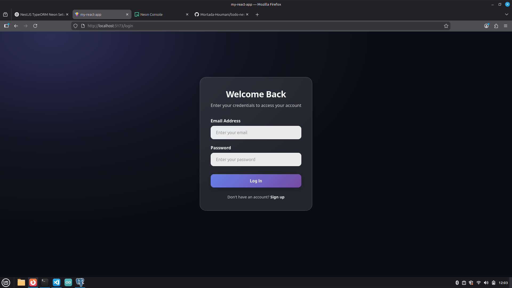
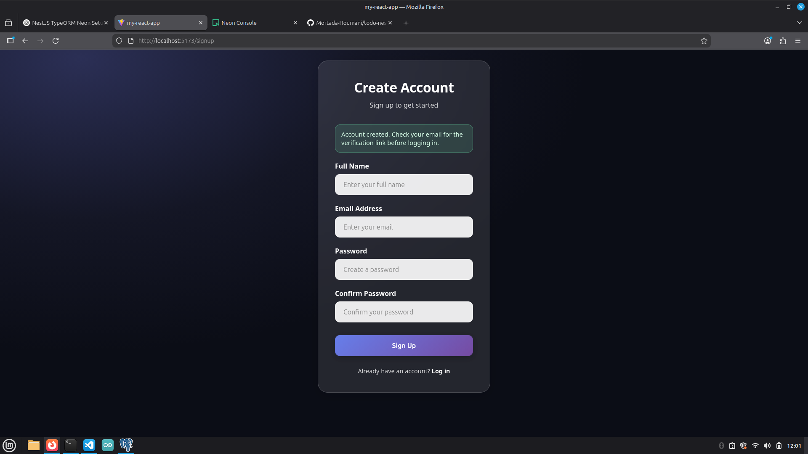

# To-Do List + Pomodoro Timer

A full-stack productivity application that combines task management with the Pomodoro Technique to help users stay focused and organized.

## Features

- Create, edit, and delete tasks
- Pomodoro timer integration for focused work sessions
- User authentication with JWT
- Email verification system
- Secure password hashing
- RESTful API architecture

## Tech Stack

**Frontend:**
- React.js
- React Router
- CSS

**Backend:**
- NestJS
- TypeORM
- PostgreSQL (Neon)
- JWT authentication
- Nodemailer (email verification)

---

