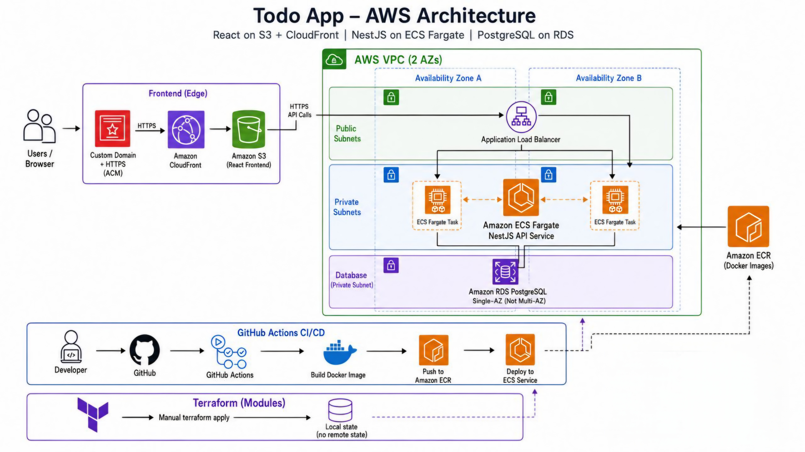
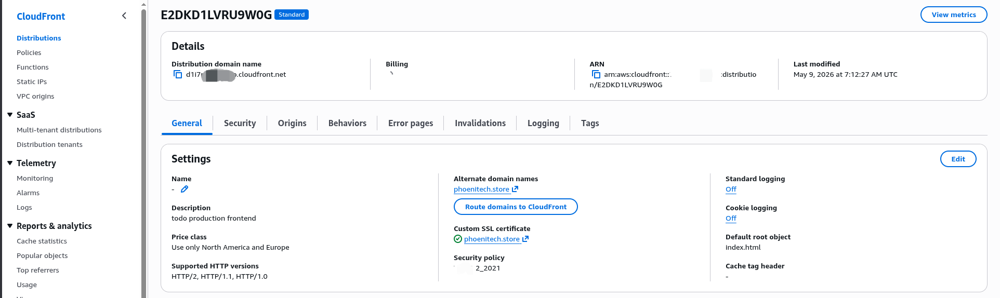
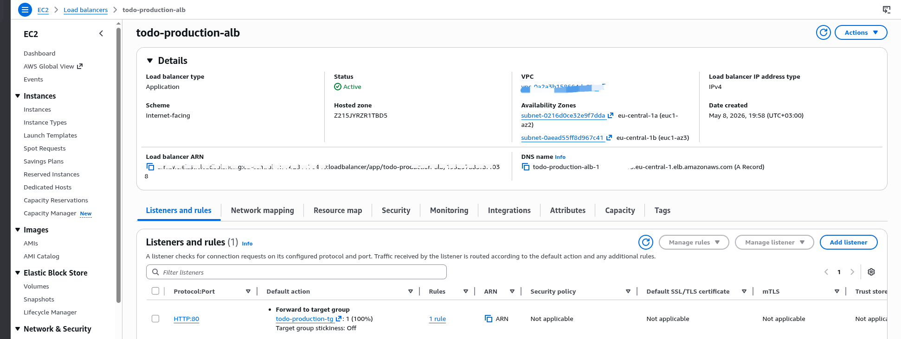
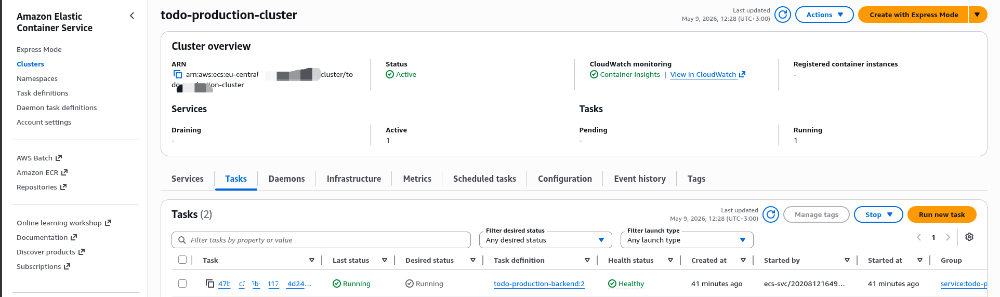
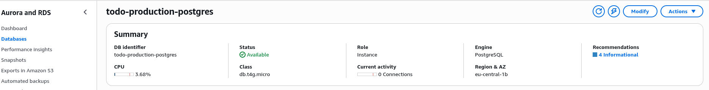
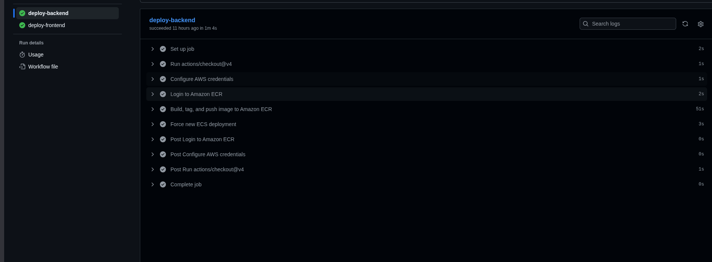
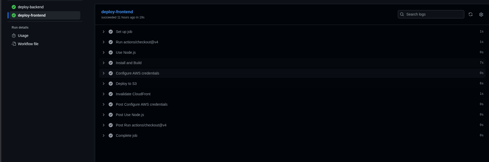
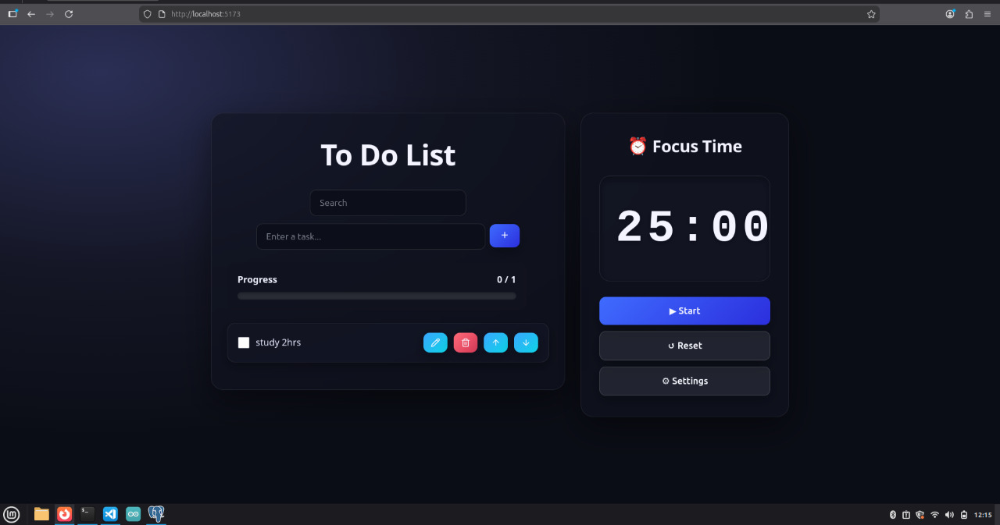

# Todo App — Full-Stack AWS Deployment 

A production-ready Todo application built with **NestJS** and **React**, deployed on a highly available **AWS Infrastructure** using **Terraform** and **GitHub Actions**.

---

##  Architecture Overview

The application is hosted on AWS using a secure, multi-tier networking setup.




### Global Delivery (CloudFront)
Requests are served through **Amazon CloudFront**, providing low-latency delivery and SSL termination.



### Load Balancing (ALB)
The **Application Load Balancer** handles API routing and health checks for the backend containers.



### Container Orchestration (ECS Fargate)
The NestJS backend runs on **Amazon ECS** with **Fargate**, providing serverless container execution.



### Database (RDS PostgreSQL)
Data is stored in a managed **Amazon RDS** instance within a private subnet.



---

## CI/CD Pipeline (GitHub Actions)

We use automated workflows for continuous integration and deployment.

### Backend Deployment
Builds Docker images, pushes to ECR, and updates the ECS service.



### Frontend Deployment
Builds the React app, syncs to S3, and invalidates the CloudFront cache.



---

## Documentation & Setup

> [!TIP]
> For a deep dive into the infrastructure and step-by-step setup, see the **[Cloud Deployment Guide](./CLOUD_DEPLOYMENT.md)**.

### API Documentation
Interactive documentation is available via **Swagger**:
- **Live URL:** [https://phoenitech.store/docs](https://phoenitech.store/docs)

### Project Structure
```text
├── client/              # React frontend (Vite)
├── server/              # NestJS backend (API)
├── terraform/           # Infrastructure as Code (AWS)
├── screenshots/         # Infrastructure documentation images
└── README.md            # Main documentation
```

---

## Features
- Full CRUD Task Management
- Pomodoro Timer integration
- Secure JWT Authentication
- Email verification system
- HTTPS/TLS encryption everywhere
- Fully containerized architecture



