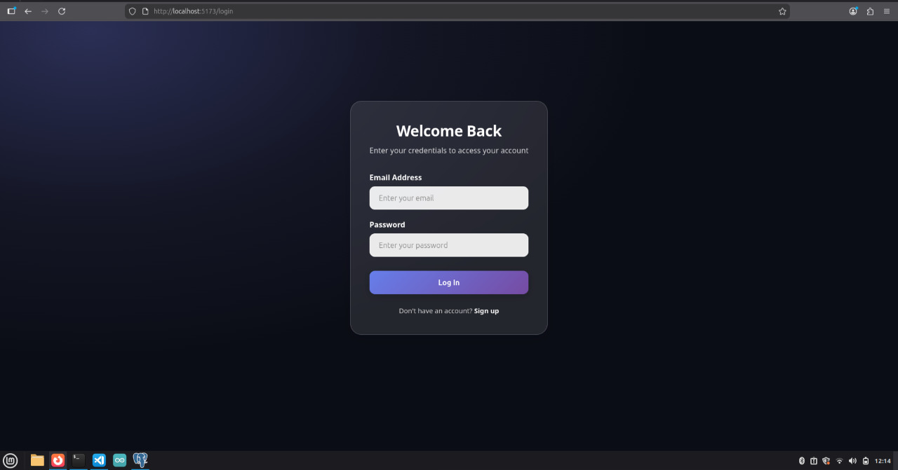
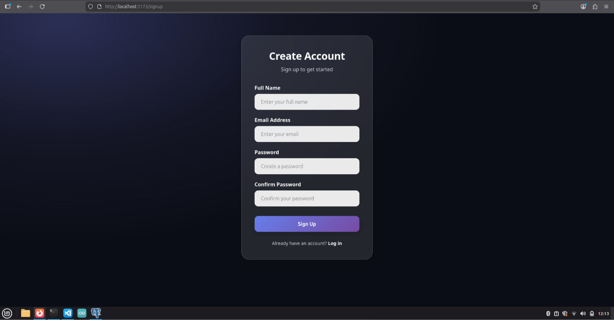

# Todo App — Full-Stack AWS Deployment 

A production-ready Todo application built with **NestJS** and **React**, deployed on a **AWS Infrastructure** using **Terraform** and **GitHub Actions**.

---

---

## Architecture

The application is hosted on AWS using modern cloud-native services:

- **Frontend:** React application hosted on **Amazon S3** and served globally via **Amazon CloudFront** (CDN).
- **Backend:** NestJS API running in **Docker** containers on **Amazon ECS (Fargate)**.
- **Database:** **Amazon RDS (PostgreSQL)** in a private subnet.
- **Networking:** Custom **VPC** with public/private subnets and an **Application Load Balancer** (ALB) acting as an internal entry point for CloudFront.
- **Proxy:** CloudFront serves both the frontend and the API (under `/api/*`), solving **CORS** and **Mixed Content** issues automatically.

---

## CI/CD Pipeline

The project uses **GitHub Actions** for fully automated deployments.

### Backend Workflow:
1. Builds a production Docker image.
2. Pushes the image to **Amazon ECR**.
3. Triggers an **ECS Service Update** to roll out the new version.

### Frontend Workflow:
1. Compiles the React application (Vite).
2. Syncs the build files to the **S3 Bucket**.
3. **Invalidates the CloudFront Cache** so users see the latest changes instantly.

---
 

## Infrastructure (Terraform)

The infrastructure is managed as code using **Terraform**.

---

## Features

- Full CRUD Task Management
- Pomodoro Timer integration
- Secure with JWT Authentication
- Email verification system
- HTTPS/TLS encryption everywhere
- Fully containerized backend

---

